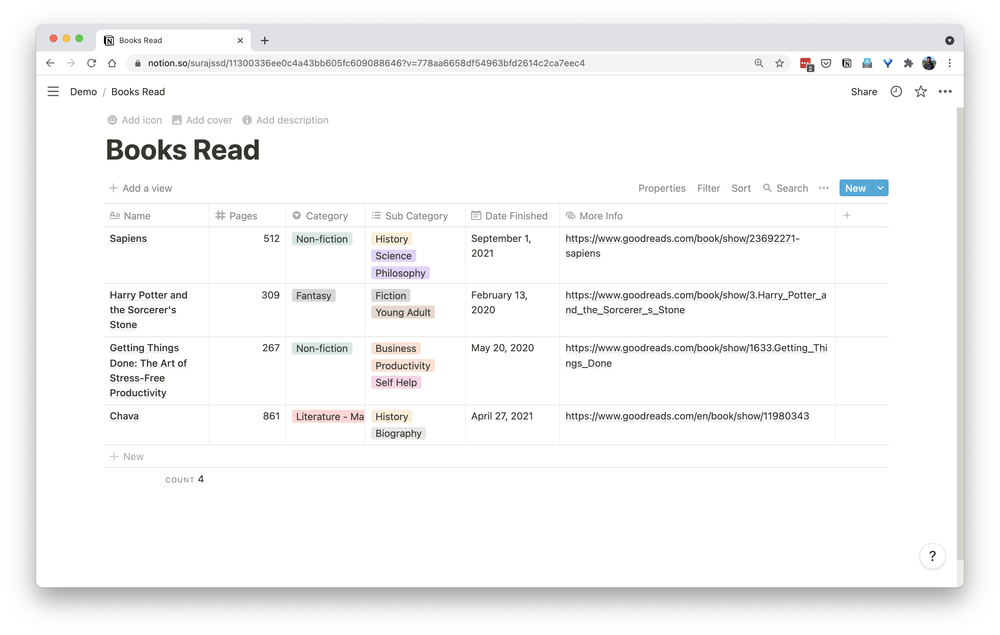
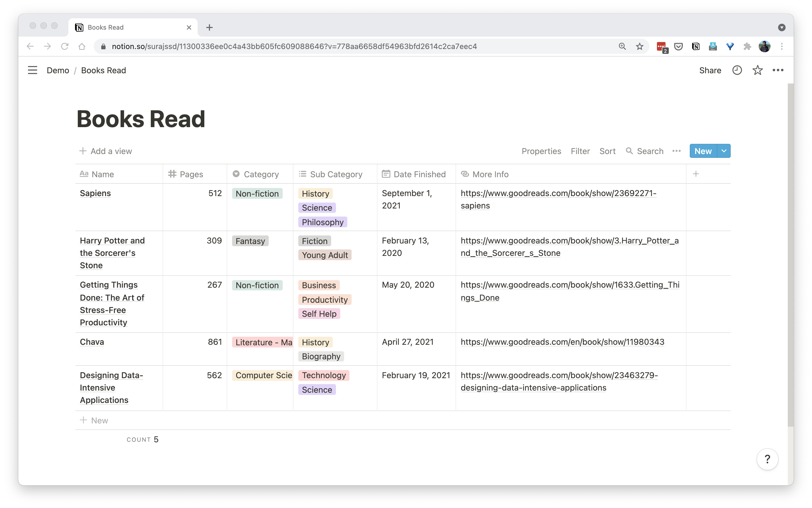

# Add a page to the DB

This page shows a sample code on how to use the library to add an entry to a database.

## Database Schema

You can see that the database has six columns and four entries of the books.



## Code

```go
package main

import (
	"fmt"
	"github.com/surajssd/libnotion/api"
	"github.com/surajssd/libnotion/pkg/rest"
)

func main() {
	// Get this ID before hand either using an API, from a config file or by
	// hardcoding it.
	parentDBID := ""

	page := api.Page{
		Parent: api.Parent{
			// This is to signify that this page is a row in a table/database.
			Type:       api.ParentTypeDatabase,
			DatabaseID: parentDBID,
		},
		// Here specify what each column of database will contain for this row.
		// The rows of table "Books Read" are Name, Pages, Category, Sub
		// Category, Data Finished, More Info.
		Properties: map[string]api.ValueProperty{
			// Each one of these ValueProperty has a compulsory field "Type".
			// This tells the API what type of data we are sending.
			"Name": {
				Type: api.ValuePropertyTypeTitle,
				Title: []api.Title{
					{Type: "text", Text: api.Text{Content: "Designing Data-Intensive Applications"}},
				},
			},
			"Pages": {
				Type:   api.ValuePropertyTypeNumber,
				Number: 562,
			},
			"Category": {
				Type:   api.ValuePropertyTypeSelect,
				Select: &api.Option{Name: "Computer Science"},
			},
			"Sub Category": {
				Type: api.ValuePropertyTypeMultiSelect,
				MultiSelect: []api.Option{
					{Name: "Technology"},
					{Name: "Science"},
				},
			},
			"Date Finished": {
				Type: api.ValuePropertyTypeDate,
				Date: &api.DateRange{
					Start: "2021-02-19",
				},
			},
			"More Info": {
				Type: api.ValuePropertyTypeURL,
				URL:  "https://www.goodreads.com/book/show/23463279-designing-data-intensive-applications",
			},
		},
	}

	// Create a new Notion client.
	nc := rest.NewNotionClient(rest.WithSecretToken(token))
	if _, err := nc.AddPage(page); err != nil {
		panic(err)
	}

	fmt.Println("page added successfully!")
}
```

## In Action

```bash
$ go run main.go
page added successfully!
```

## Database after API call

Now you can see that after the code was run a fifth entry is added for the book: "Designing Data-Intensive Applications".

